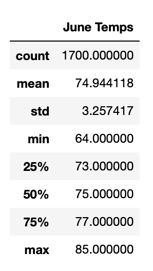
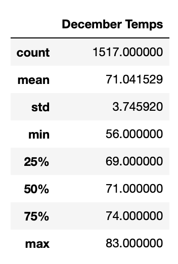

# Statistical Analysis
---
## Overview of the Analysis
---
Using Python, Pandas functions and methods, and SQLAlchemy, filter the date column of the Measurements table in the `hawaii.sqlite` database to retrieve all the temperatures for the month of `June` and for the month of `December`. Then convert those temperatures to a list, create a DataFrame from the list, and generate the summary statistics.

## Results
---
- `Maximum temperature` in the month of June is 85
- `Maximum temperature` in the month of December is 83 
- The `Average temperature` is 74.99 and 71.042 for the month of June and December respectively 
- The `Minimum temperature` difference is about 8, June's minimum is 64 and December's minimum is 56

## Summary
---
#### June Summary:

/img

#### December Summary:

/img

- We can do analysis and find out temperature for the month of June and December for the most active station `USC00519281`

   #### For the month of June:

   `session.query(func.min(Measurement.tobs), func.max(Measurement.tobs), func.avg(Measurement.tobs)).\
filter(Measurement.station == 'USC00519281', extract('month', Measurement.date)==6).all()`

    - Output:
        - Minimum: 65.0, 
        - Maximum: 82.0, 
        - Average: 73.27118644067797
  
   #### For the month of December:
    `session.query(func.min(Measurement.tobs), func.max(Measurement.tobs), func.avg(Measurement.tobs)).\
filter(Measurement.station == 'USC00519281', extract('month', Measurement.date)==12).all()`

    - Output :
      - Minimum: 58.0
      - Maximum: 79.0
      - Average: 69.90322580645162
